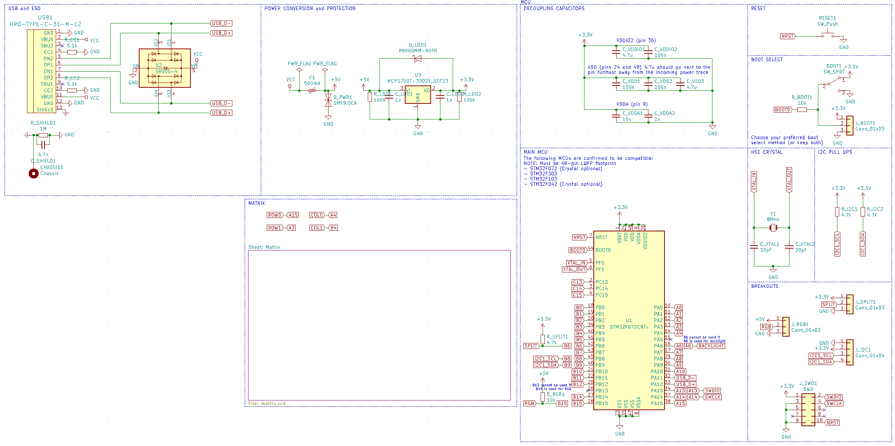
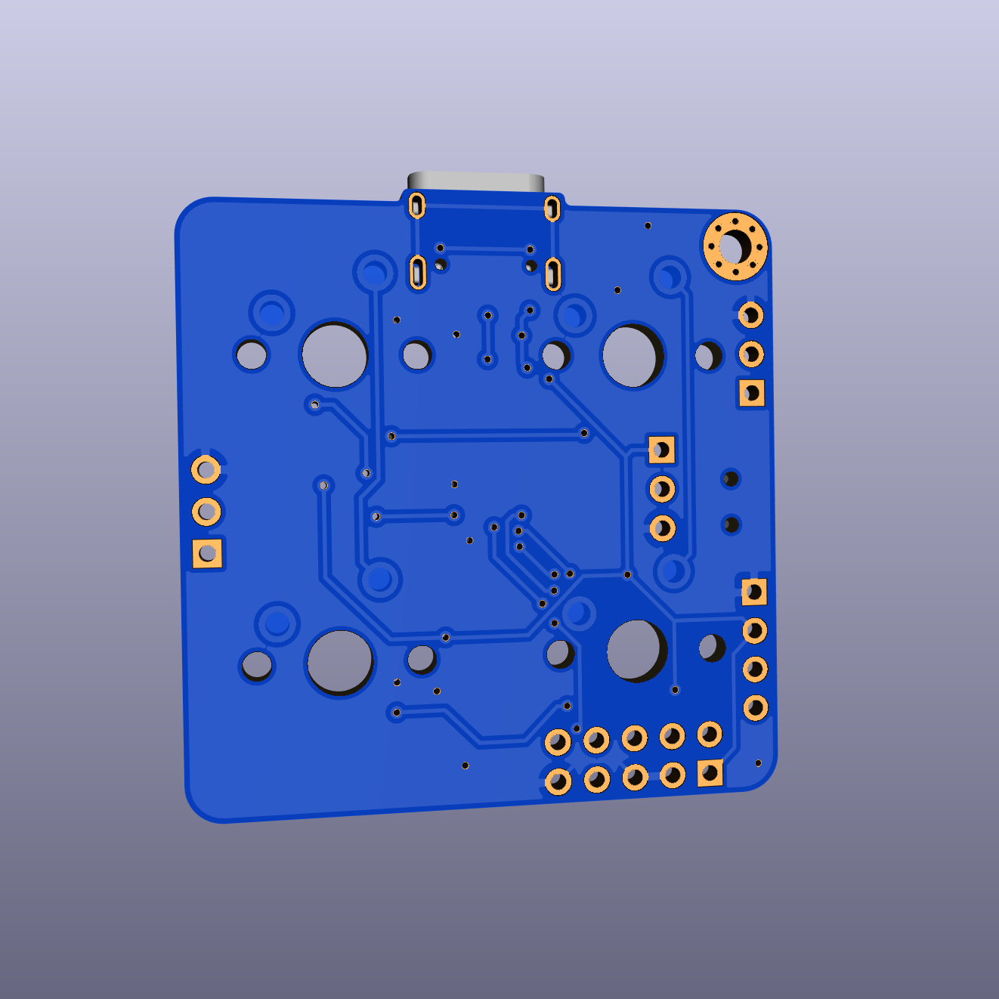
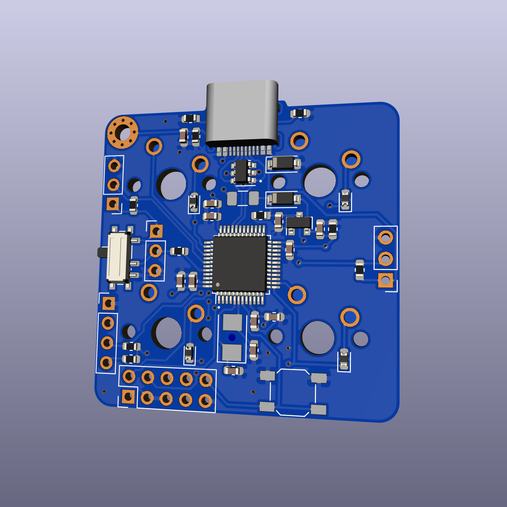

# STM32 Keyboard Reference Project

## Goals

The primary goal of this project is to provide a semi-opinionated starting point for people new to STM32 microcontrollers.
A majority of commonly used keyboard features are broken out on pins that are best suited for the purpose. (RGB on SPI, split on USART, etc)

A secondary goal of this project is to provide a schematic that allows for swapping between a number of readily available STM32 MCUs based on need and availability.

An example BOM is listed below, while a majority of parts are JLCPCB basic parts, the goal of this project is not to provide a _cheap_ project, but a common project.

Components used are 0603 or larger as to make hand solderability as easy as possible for the designer.

## Libraries Used

The following non-standard libraries were used to design this project:

- [ai03-2725/Type-C.pretty](https://github.com/ai03-2725/Type-C.pretty)
- [ai03-2725/MX_Alps_Hybrid/MXOnly.pretty](https://github.com/ai03-2725/MX_Alps_Hybrid)

It is recommended to include these as global libraries in KiCAD, as they are very commonly used on most keyboard projects.

## Pictures

### Schematic

### PCB

## BOM

| Designator | Description | Package | LCSC Part Number |
:-----------: :-----------: :-------: :-----------------:
U1 | STM32F072 | LQFP-48 | 12345

## License

This project is licensed under the Unlicense. Please see [LICENSE](LICENSE) for more information.
